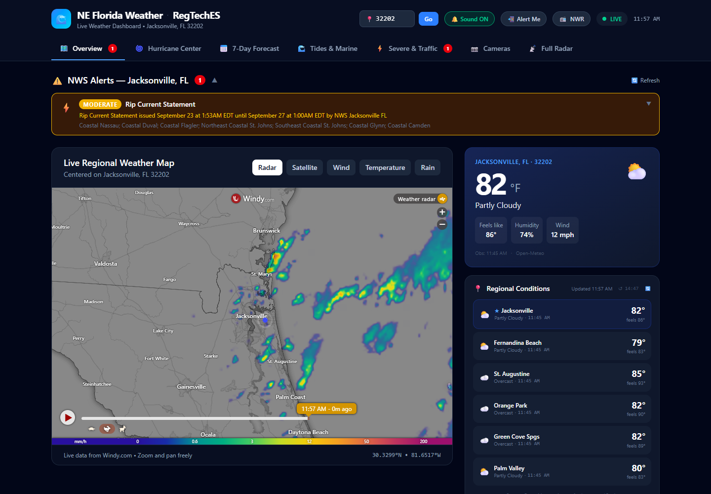
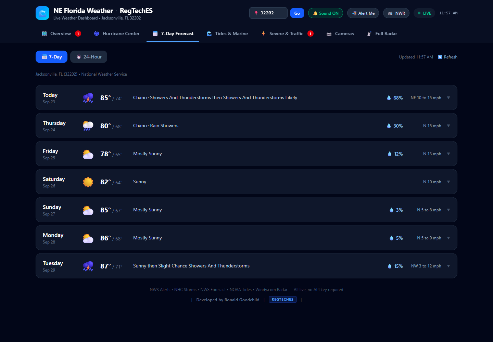

# Weather Dashboard

A free, **single-file weather dashboard** built with React, TypeScript, Vite and Tailwind. It pulls live data from public U.S. government sources - forecasts, **severe-weather alerts**, hurricane tracking, tides, radar and NOAA Weather Radio - and can push alerts to your phone with [ntfy](https://ntfy.sh). Built for Northeast Florida; change the ZIP code and the location-based panels follow.

> Not affiliated with NOAA or the National Weather Service. Always follow official warnings.

## Screenshots


*Overview: live alerts, radar and regional conditions*


*7-day forecast from the National Weather Service*

## Features

Type any U.S. ZIP code and **every tab follows it** (or open `?zip=90210` for a shareable link):

- **Overview** - current conditions for your ZIP plus nearby towns, named by the NWS
- **Forecast** - multi-day forecast from the NWS API for your exact point
- **Severe** - active NWS alerts for your forecast, county and fire-weather zones, severe-weather outlooks, and lightning; live traffic incidents for Florida ZIPs and a link to your state's 511 site elsewhere
- **Hurricane** - National Hurricane Center products, the basin closest to you, and your local NWS office's Hurricane Local Statement
- **Tides** - NOAA Tides & Currents predictions for the three tide stations nearest your ZIP (with a note when the coast is far away)
- **Cameras** - traffic camera links for your state, beach maps, your nearest NWS radar station and the GOES satellite sector for your region
- **NOAA Weather Radio** player: reads the live list of relay streams from wxradio.org and offers the ones nearest your ZIP (if a transmitter's main stream is down it tries its backup)
- **Push notifications** through ntfy.sh for new alerts (browser-side, or run the included monitor script)
- Builds to **one self-contained `index.html`** you can host anywhere or open from disk

## Quick start

```bash
git clone https://github.com/ronaldgoodchild/weather-dashboard.git
cd weather-dashboard
npm ci
npm run dev        # http://localhost:5173
npm run build      # single-file build in dist/index.html
```

Requires Node.js 20+.

## Alerts to your phone

1. Pick a long, random **ntfy topic** (anyone who knows the topic name can read it - treat it like a password) and subscribe to it in the ntfy app.
2. Either enter it in the dashboard's notification settings, **or** run the headless monitor:
   ```bash
   WX_ZIP=90210 NTFY_TOPIC=your-long-random-topic node monitor/weather-monitor.mjs
   ```
   The monitor watches **the ZIP code you give it** (`WX_ZIP`, or `--zip 90210`): it looks up your NWS alert zones once, caches them, and uses your local time zone in notifications. Try it without sending anything: `node monitor/weather-monitor.mjs --zip 90210 --dry-run`. Add it to cron (see the top of the script) to run every 5 minutes.
3. Prefer GitHub Actions? Copy `docs/weather-alerts.workflow.yml.example` into `.github/workflows/` **in your own fork**, add an `NTFY_TOPIC` repository secret, and set the ZIP code in the file. It polls every 5 minutes for free.

## Data sources

api.weather.gov (NWS), NOAA Tides & Currents, National Hurricane Center, Storm Prediction Center, radar.weather.gov, NOAA GOES imagery, wxradio.org, Windy embed, Blitzortung, Florida DOT (DIVAS) and each state's 511 site, and api.zippopotam.us for ZIP lookups. Please respect each provider's terms and rate limits; the NWS API asks for a descriptive `User-Agent`.

## Contributing

Ideas and pull requests welcome - see [CONTRIBUTING.md](CONTRIBUTING.md) and [ROADMAP.md](ROADMAP.md).

## License

[MIT](LICENSE) (c) 2026 Ronald Goodchild / REGTeches
